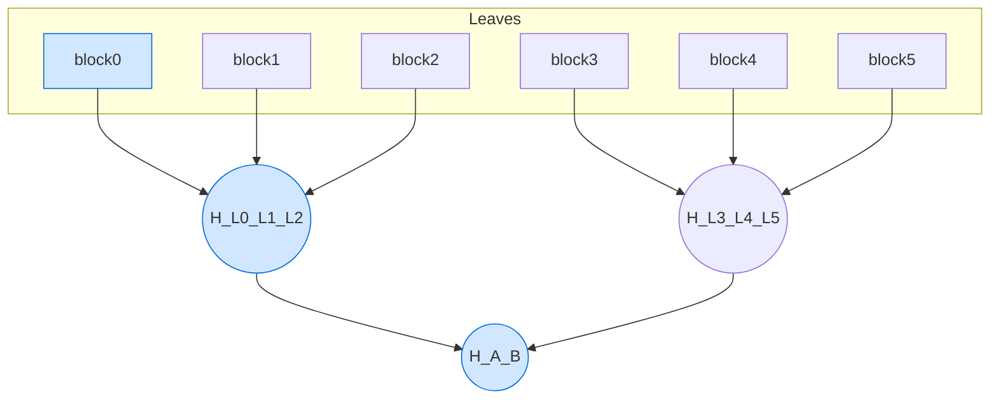
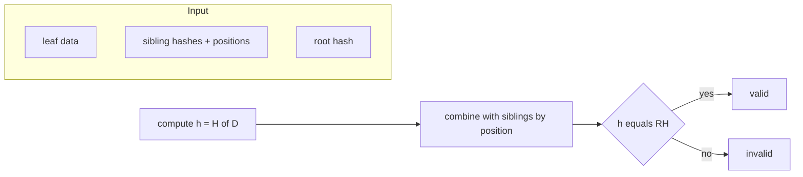

# tmt-js

Ternary Mesh Tree (TMT) for JavaScript/TypeScript — a compact, update‑friendly, BLAKE3‑based authenticated data structure. Use it to build Merkle‑like trees with ternary fan‑out (up to 3 children per node), generate and verify compact proofs, perform fast incremental updates, collect metrics, and serialize/deserialize to JSON.

This README documents the npm package as `tmt-js`.

## Why TMT?

- Merkle‑like integrity: tamper‑evident structure with a single root hash.
- Ternary fan‑out: fewer levels than binary for the same number of leaves; typically shorter proofs.
- Update‑friendly: recalculate only the path to the root when a leaf changes.
- Compact proofs: at most 2 sibling hashes per level (for 3‑ary branching).
- BLAKE3 hashing: modern, fast, parallelizable hash function with strong security properties.
- JSON serialization: persist and reload trees across processes or sessions.
- Optional hash caching and basic metrics.

## Installation

```bash
npm install tmt-js
# or
yarn add tmt-js
# or
pnpm add tmt-js
```

Node 16+ recommended. The library targets browsers and Node; actual parallelism of hashing depends on the `blake3` implementation for your environment.

## Quick Start

```ts
import TernaryMeshTree, { hashToHex } from 'tmt-js';

const enc = new TextEncoder();
const blocks = [enc.encode('block1'), enc.encode('block2'), enc.encode('block3')];

const tree = new TernaryMeshTree();
await tree.build(blocks);

const [root] = tree.getRootHash();
console.log('root:', root && hashToHex(root));

const [ok, err] = await tree.verify(0, enc.encode('block1'));
console.log('verified?', ok, err);

await tree.update(0, enc.encode('block1-updated'));
const [ok2] = await tree.verify(0, enc.encode('block1-updated'));
console.log('verified after update?', ok2);
```

## What It Is

TMT is a tree of hashes where:

- Leaves store `H(data)` for data blocks.
- Internal nodes store `H(h1 || h2 || ... || hk)` where `k ∈ {2, 3}` and `hi` are child hashes.
- The root hash authenticates all data below it. Any change to any leaf changes the root.

Padding: when building, the leaf layer is padded with empty leaves (`H("")`) so the initial layer length is divisible by 3. Higher layers may still have 2‑child nodes at the top.

## How It Works

1) Build

- Compute each leaf hash `hi = H(data_i)` (BLAKE3).
- Group consecutive nodes in chunks of up to 3: `[n0,n1,n2], [n3,n4,n5], ...`.
- For each group, compute the parent hash as BLAKE3 of the concatenation of child hashes.
- Repeat until a single root remains.

2) Update

- Update a leaf hash and recompute hashes on the path to the root only (siblings remain unchanged).

3) Proofs

- To prove leaf `i`, produce the siblings’ hashes for each level plus their positions; the verifier recomputes hashes upward and compares the final value with the known root.

### Math Behind It

- Hash function: `H = BLAKE3` producing 32‑byte outputs.
- Leaf hashing: `h_i = H(data_i)`.
- Parent of `k` children (2 ≤ k ≤ 3):
  `h_parent = H(h_child[0] || h_child[1] || ... || h_child[k-1])` where `||` is byte concatenation.
- Root: iterative application of the parent rule until one node remains.
- Proof for leaf `i`: at each level, include the `k-1` sibling hashes and their positions to reconstruct the parent hash.

Complexity and Size:

- Build: O(n) hash ops; height ≈ ceil(log_3 n).
- Update: O(log n) recomputation along the path to root.
- Proof size: at most 2 sibling hashes per level → ≤ 2·ceil(log_3 n) hashes, each 32 bytes.

Collision Resistance:

- Security reduces to the collision resistance of BLAKE3 and the injectivity of byte concatenation layout. Concatenation is unambiguous because child order and count are fixed by tree structure and enforced by stored child positions in proofs.

## Visuals (Mermaid)

Triple‑branching tree with a proof path from `L0` to root:




Proof verification flow for a single leaf:




Note: GitHub and many renderers support Mermaid; on others these blocks appear as code.

## API

All types are fully typed in TypeScript.

Top‑level exports:

- `default` (class): `TernaryMeshTree`.
- `computeHash(data: Uint8Array): Uint8Array`
- `combineHashes(hashes: Uint8Array[]): Uint8Array`
- `hashToHex(h: Uint8Array): string`
- `defaultConfig(): Config`
- `TMTError`, `ErrorMessages`
- `selfTest(): Promise<void>`

Types:

- `type Hash = Uint8Array` (32 bytes)
- `type NodeID = number`
- `interface Config { enableCaching: boolean; maxCacheSize: number; enableMetrics: boolean; parallelThreshold: number; }`
- `interface Metrics { buildTimeMS: number; lastVerificationTimeNS: number; lastUpdateTimeNS: number; totalVerifications: number; totalUpdates: number; memoryUsageBytes: number; }`
- `interface VerificationProof { leafIndex: number; siblingHashes: { pos: number; hash: Hash }[]; pathLength: number; }`

Methods (TernaryMeshTree):

- `build(dataBlocks: Uint8Array[]): Promise<void>`: builds a tree from blocks. Pads leaves with `H("")` to make count divisible by 3.
- `verify(leafIndex: number, data: Uint8Array): Promise<[boolean, Error|null]>`: proves that `data` is at `leafIndex` under the current root.
- `update(leafIndex: number, newData: Uint8Array): Promise<void>`: updates a single leaf and recomputes ancestors.
- `batchUpdate(updates: Map<number, Uint8Array>): Promise<void>`: updates multiple leaves efficiently.
- `generateProof(leafIndex: number): VerificationProof`: creates a compact proof for a leaf.
- `verifyProof(proof: VerificationProof, leafData: Uint8Array): [boolean, Error|null]`: verifies a proof against the current root.
- `serialize(): string`: JSON string containing nodes, leaf data, root id, leaf count.
- `static deserialize(json: string, cfg?: Config): TernaryMeshTree`: reconstructs a tree from `serialize()`.
- `getRootHash(): [Hash|null, boolean]`: returns the current root hash and a success flag.
- `getHeight(): number`: tree height (leaves are height 1).
- `getLeafCount(): number`: number of original leaves (before padding).
- `getMetrics(): Metrics`: returns metrics when enabled; zeros otherwise.

## Usage Examples

ESM imports (Node ≥16 or bundlers):

```ts
import TernaryMeshTree, { defaultConfig, computeHash, hashToHex } from 'tmt-js';

const enc = new TextEncoder();
const cfg = defaultConfig();
cfg.enableCaching = true;

const t = new TernaryMeshTree(cfg);
await t.build([
  enc.encode('alpha'),
  enc.encode('beta'),
  enc.encode('gamma'),
]);

const [root] = t.getRootHash();
console.log('root:', root && hashToHex(root));

// Generate and verify a proof externally:
const proof = t.generateProof(1); // leaf index 1
const [okProof] = t.verifyProof(proof, enc.encode('beta'));
console.log('proof valid?', okProof);

// Update some data and re-verify
await t.update(1, enc.encode('beta+1'));
const [okNew] = await t.verify(1, enc.encode('beta+1'));
console.log('verified after update?', okNew);

// Serialize and restore later
const blob = t.serialize();
const t2 = TernaryMeshTree.deserialize(blob, cfg);
const [r1] = t.getRootHash();
const [r2] = t2.getRootHash();
console.log('same root after deserialize?', !!r1 && !!r2 && hashToHex(r1!) === hashToHex(r2!));
```

CommonJS (Node require):

```js
const { default: TernaryMeshTree, defaultConfig, hashToHex } = require('tmt-js');
const { TextEncoder } = require('util');

const enc = new TextEncoder();
const t = new TernaryMeshTree(defaultConfig());
```

Batch update example:

```ts
const updates = new Map<number, Uint8Array>([
  [0, enc.encode('new-0')],
  [2, enc.encode('new-2')],
]);
await t.batchUpdate(updates);
```

Working with raw hashes:

```ts
import { computeHash, combineHashes, hashToHex } from 'tmt-js';

const h = computeHash(new Uint8Array([1,2,3]));
console.log(hashToHex(h));

const parent = combineHashes([h, h, h]);
console.log(hashToHex(parent));
```

## Configuration & Performance

- `enableCaching`: caches leaf hashes during build. Useful if many identical blocks repeat.
- `maxCacheSize`: cap for the cache map to bound memory.
- `enableMetrics`: populates `Metrics` after builds and verifications.
- `parallelThreshold`: when the number of nodes in a level ≥ this threshold, child‑group hashing is scheduled via `Promise.all`. Whether that achieves true parallelism depends on the environment and `blake3` runtime (native/WASM).

Metrics example:

```ts
const m = t.getMetrics();
console.log({
  buildTimeMS: m.buildTimeMS,
  lastVerificationTimeNS: m.lastVerificationTimeNS,
  memoryUsageBytes: m.memoryUsageBytes,
});
```

## Suitable Use Cases

- Content‑addressed storage and deduplication.
- Package or artifact registries (verify downloads against roots published in logs).
- Tamper‑evident logs or append‑only journals.
- CDN and edge caches (prove inclusion of a chunk in a build).
- Blockchain/stateless verification primitives where compact proofs matter.
- Database snapshot integrity and incremental verification.

## Notes & Caveats

- Not a Patricia/Merkle‑Patricia tree; keys and paths are implicit by index order.
- Proofs are index‑based; rearranging leaves changes the tree.
- Padding with empty leaves means the padded leaves do not belong to the logical dataset; they only help regularize the base layer.
- Parallel build uses `Promise.all` to schedule hash computations per chunk; actual parallelism depends on your JS engine and `blake3` binding.
- Root comparison requires an out‑of‑band trusted root (e.g., pinned value, signed checkpoint).

## Development

Build, test, and lint (repo scripts):

```bash
npm run build
npm test
npm run lint
```

Type definitions are shipped with the package.

## License

MIT © Contributors. See `LICENSE`.
